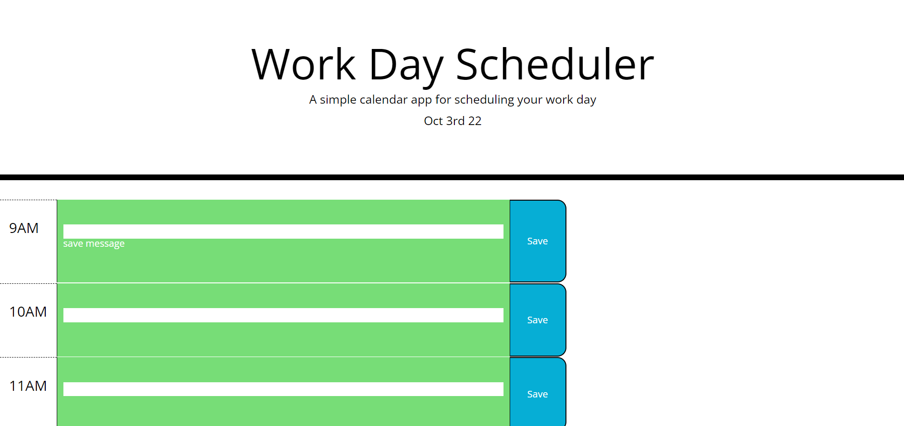

# Work Scheduler 

## Description
This program was created in order to keep track of your daily work, during the business hours of 9am-5pm.

## Installation
N/A

## Usage

Visit this link to view website: https://ssangwang.github.io/Module-3-Challenge/

-Insert Reminder that you would like into text box at the time you would like
-Click "Save" button on right hand side to save text submission to calender
-Refresh page to see reminder! 

## Credits 
Nathan Darter - TA 
Akon Abazary - TA 

## License
See Repository 